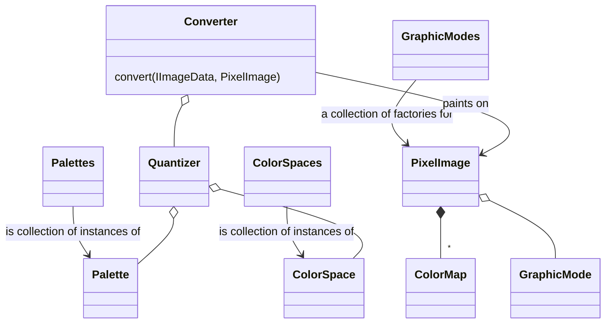

# Development

The build process has been tested on macOS.
It should work on other platforms but you're on your own there.

## Prerequisites

- [Git](https://git-scm.com)
- [NodeJS](https://nodejs.org) (latest LTS version)
- [Yarn](https://yarnpkg.com/en/docs/install#mac-stable)
- GNU make

## Build

    git clone https://github.com/micheldebree/retropixels.git
    cd retropixels/cli
    make

Run with `node cli.js [options] <infile>`
  
Retropixels is split into two npm packages:

- `retropixels`, the command line tool, in `cli`, with dependency to `retropixels-core`
- `retropixels-core`, the core functionality, in `core`

During development change the dependency in `cli/package.json`, and re-install when needed.

```json
"retropixels-core": "../core",
```

## TODO

- [ ] Use image-q library
- [ ] Separate CLI from core and get rid of filesystem dependencies in core
- [ ] Where do black pixels come from in xyz color space?
- [x] Avoid quantizing the same pixel twice
- [ ] Performance
  - [ ] Initialize arrays to fixed size?
- [ ] Separate variable components
  - [ ] Colorspace conversions
  - [ ] Distance measuring
  - [ ] Color reducer within a cell
 - [ ] Separate graphicmode from pixelimage

## Local development

## Classes

[Mermaid class diagram](https://mermaid-js.github.io/mermaid/#/classDiagram)



## References

<https://en.wikipedia.org/wiki/Perceptual_hashing>
<https://github.com/pahen/madge>
<https://www.npmjs.com/package/image-q>
