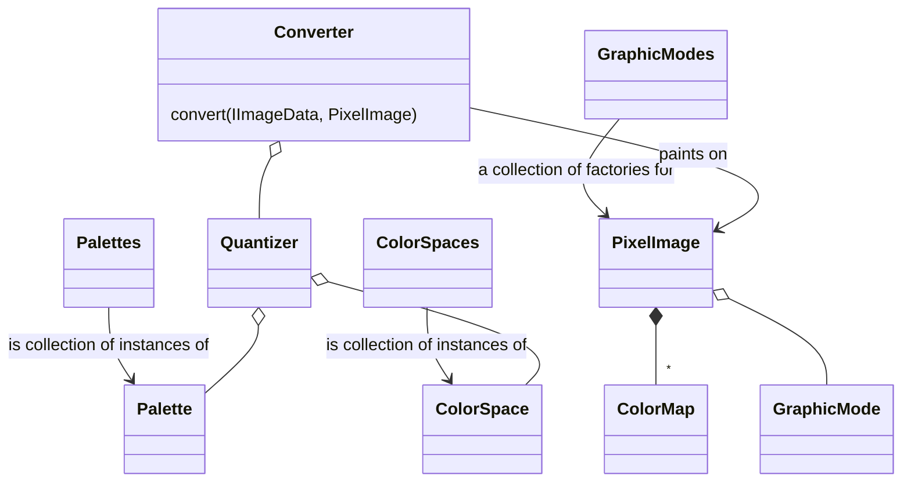

# Development

## TODO

- [ ] Separate CLI from core and get rid of filesystem dependencies in core
- [ ] Where do black pixels come from in xyz colorspace?
- [x] Avoid quantizing the same pixel twice
- [ ] Performance
  - [ ] Initialize arrays to fixed size?
- [ ] Separate variable components
  - [ ] Colorspace conversions
  - [ ] Distance measuring
  - [ ] Color reducer within a cell

## Classes

[Mermaid class diagram](https://mermaid-js.github.io/mermaid/#/classDiagram)

## References

<https://en.wikipedia.org/wiki/Perceptual_hashing>
<https://github.com/pahen/madge>
