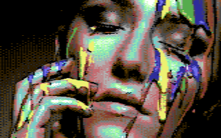

# retropixels

A cross platform command line tool to convert images to Commodore 64 format.

## Summary


``retropixels paintface.jpg paintface.png``



## For users

### Installation

- Install [NodeJS](https://nodejs.org)
- Run ``npm install -g retropixels``

You now have a new shell command called ``retropixels``

### Usage

```sh
retropixels [options] <infile> <outfile>
```

With

- ``<infile>``: the image to convert
- ``<outfile>``: the converted image. The extension determines the format:
  - ``<outfile>.png`` produces a PNG file
  - ``<outfile>.kla`` produces a Koala Painter file
                      (only supported for c64Multicolor mode)
  - ``<outfile>.prg`` produces a Commodore 64 executable
- ``[options]``:
  - ``-m <mode>`` with ``<mode>``:
    - ``c64Multicolor`` (default)
    - ``c64Hires``
    - ``c64HiresMono``
    - ``c64FLI``
    - ``c64AFLI``
  - ``-d <ditherMode>`` with ``<ditherMode>``:
    - ``bayer2x2``
    - ``bayer4x4`` (default)
    - ``bayer8x8``
  - ``-r <ditherRadius>`` with ``<ditherRadius>``:
    - A number between 0 (no dithering) and 64 (heavy dithering). Default is 32.

Notes:

- The FLI/AFLI display code was found on [codebase64.org](http://codebase64.org/doku.php?id=base:fli_displayer)
- FLI/AFLI modes result in an issue with the leftmost 3 characters on
  each row being unusable.
  You will see a blank space in the image. This is a limitation of the
  Commodore 64 VIC chip hacking
  involved in creating this artificial mode, and is not a bug in retropixels

### Example

Convert an image to a Commodore 64 executable:

```sh
retropixels -b bayer8x8 -r 64 eye.jpg eye.prg
```

View the result by running it in the
[VICE](http://vice-emu.sourceforge.net) emulator:

```sh
x64 eye.prg
```

### Uninstall

```sh
npm uninstall -g retropixels
```

## For developers

The build process has been tested on macOS.
It should work on other platforms but you're on your own there.

### Prerequisites

- [NodeJS](https://nodejs.org) (latest LTE version)
- [Git](https://git-scm.com)
- GCC
- GNU make

#### Build

- Clone or unzip this project

```sh
cd retropixels
npm install -g typescript@2.3.3
make
```

Run with ``node index.js [options] <infile> <outfile>``

### Build Docker image

```sh
docker build -t micheldebree/retropixels-cli .
```

### Run the conversion tool with [Docker](https://www.docker.com)

The command line tool can be run with docker.
The only prerequisite for this is Docker itself:

```sh
docker run --rm -v "$PWD":/data micheldebree/retropixels-cli [options] <infile> <outfile>
```

The first time docker will download the image.
Be patient. Next time it will get it from your local cache.

## Changelog

### 0.6.0

Features:

- [#19](https://github.com/micheldebree/retropixels/issues/19): Undocumented 'fake' modes.

Fixes:
[#21](https://github.com/micheldebree/retropixels/issues/21),
[#23](https://github.com/micheldebree/retropixels/issues/23)

### 0.5.2

Bugfix:

- [#22](https://github.com/micheldebree/retropixels/issues/22)
  Fixed small dithering bug.

### 0.5.1

Internal refactoring.

### 0.5.0

All modes now support saving as Commodore 64 executable (.prg)

- [#3](https://github.com/micheldebree/retropixels/issues/3)
  Export PRG for c64Hires mode
- [#4](https://github.com/micheldebree/retropixels/issues/4)
  Export PRG for c64FLI mode
- [#18](https://github.com/micheldebree/retropixels/issues/18)
  Export PRG for c64AFLI mode

### 0.4.1

- [#16](https://github.com/micheldebree/retropixels/issues/16)
  Fixed suboptimal FLI color optimization
- [#17](https://github.com/micheldebree/retropixels/issues/17)
  Made FLI bug visible in PNG export

### 0.4.0

- Export FLI executable.
- Internal refactoring.

### 0.3.0

Dithering options added:

- ditherMode
- ditherRadius

### 0.2.2

Optimized dithering, with better default setting.

### 0.2.1

- Fixes in ``README.md``

### 0.2.0

- Library: ported to Typescript
- Conversion tool: support for graphicMode c64Hires

### 0.1.0

Initial version.
