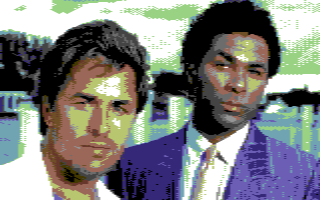

# retropixels

A command line tool to convert images to c64 format.




## For users

### Installation

- Install [NodeJS](https://nodejs.org)
- Run ``npm install -g retropixels``

You now have a new shell command called ``retropixels``

### Usage

```bash
retropixels [options] <infile> <outfile>
```

With

- ``<infile>``: the image to convert
- ``<outfile>``: the converted image. Supported extentions are ``.png``, ``.prg`` and ``.kla``
- ``[options]``:
  - ``-m <mode>`` with ``<mode>``:
    - ``c64Multicolor`` (default)
    - ``c64Hires``
    - ``c64HiresMono``
    - ``c64FLI``
    - ``c64AFLI``

N.B. If the output file already exists, it will be overwritten.

N.B. Only ``c64Multicolor`` mode supports saving as ``.prg``

#### ``<outfile>``

The format of the outfile depends on the file extension:

- ``.png``: A PNG image
- ``.kla``: A Koala Painter image, to be opened in Koala Painter on c64
- ``.prg``: A Commodore 64 executable

### Example

Convert an image to a Commodore 64 executable:

```bash
retropixels eye.jpg eye.prg
```

View the result by running it in the
[VICE](http://vice-emu.sourceforge.net) emulator:

```bash
x64 eye.prg
```

Optionally, to save some space and loading time,
you could "crunch" (compress) the resulting ``.prg`` file using
[exomizer](https://bitbucket.org/magli143/exomizer/wiki/Home):

```bash
exomizer sfx basic eye.prg -o eye-crunched.prg
```

### Uninstall

```bash
npm uninstall -g retropixels
```

## For developers

### Build

Sourcecode is compiled from Typescript using Gulp.

- Install [Git](https://git-scm.com)
- Clone or unzip this project

```bash
cd retropixels
npm install -g typescript@2.3.3
npm install -g gulp-cli@1.3.0
npm install
gulp
```

Run with ``node index.js [options] <infile> <outfile>``

### Build Docker image

```bash
docker build -t micheldebree/retropixels-cli .
```

### Run the conversion tool with [Docker](https://www.docker.com)

The command line tool can be run with docker.
The only prerequisite for this is Docker itself:

```bash
docker run --rm -v "$PWD":/data micheldebree/retropixels-cli [options] <infile> <outfile>
```

The first time docker will download the image.
Be patient. Next time it will get it from your local cache.

## Changelog

### 0.2.2

Optimized dithering, with better default setting.

### 0.2.1

- Fixes in ``README.md``

### 0.2.0

- Library: ported to Typescript
- Conversion tool: support for graphicMode c64Hires

### 0.1.0

Initial version.
