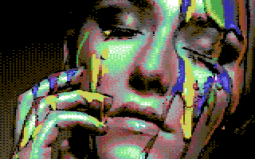

# retropixels

A cross platform command line tool to convert images to Commodore 64 format.

## Summary

    retropixels --format png paintface.jpg

## Disclaimer

This is a command line tool, meaning you have to be comfortable typing commands
into a terminal, or not afraid to find out. Windows, macOS and Linux come with
terminals pre-installed. How to use a terminal is beyond the scope of this
document.

The output of the tool consists of Commodore 64 format binaries, with the
exception of `.png` files, which are normal cross-platform images. It is not
explained what you can do with these output files, you are expected to know or
to find out yourself.

This tool contains bugs and is missing features; if you find any, you can report
them in the [Github issue tracker for this
project](https://github.com/micheldebree/retropixels/issues). There is no
guarantee these will be addressed, because this is a hobby project for me. You
are welcome to fork and submit merge requests.

The tool has been tested on macOS but should work on all operating systems
supporting NodeJS.

## Installation

Note: you do **not** need to download retropixels to install it. The `npm` command
below will do that for you.

- Install [NodeJS](https://nodejs.org) (v14 or higher. just use the defaults when asked)
- Run `npm install -g retropixels`

You now have a new shell command called `retropixels`

## Usage

    retropixels [options] <infile>

With

- `<infile>`: the image to convert
- `[options]`:
  - `--outfile, -o`: output filename
  - `--mode, -m <mode>` with `<mode>`:
    - `bitmap` (default)
    - `sprites`
    - `fli`
  - `--format, -f <format>` with `<format>`:
    - `png`: preview image
    - `prg`: c64 executable
  - `--ditherMode, -d <ditherMode>` with `<ditherMode>`:
    - `none`
    - `bayer2x2`
    - `bayer4x4` (default)
    - `bayer8x8`
  - `--ditherRadius, r <ditherRadius>` with `<ditherRadius>`:
    - A number between 0 (no dithering) and 64 (heavy dithering). Default is 32.
  - `--palette, -p <palette>` with `<palette>`:
    - `colodore` (default)
    - `pepto`
    - `deekay`
  - `--colorspace, -c <colorspace>` with `<colorspace>`:
    - `xyz` (default)
    - `yuv`
    - `rainbow`
    - `rgb` (no conversion)
  - `--cols <columns>` with `<columns>`:
    - The number of sprites in horizontal direction. `sprites` mode only.
  - `--rows <rows>` with `<rows>`:
    - The number of sprites in vertical direction. `sprites` mode only.
  - `--hires, -h`: use hires mode instead of multicolor
  - `--scale, -s <mode>` with `<mode>`:
    - `fill` (default): scale and crop to fill output dimensions
    - `none`: do not scale, only crop
  - `--nomaps`: restrict to a single color per attribute type or sprite
  - `--overwrite`: overwrite if output file already exists

Notes:

- The FLI/AFLI display code was found on [codebase64.org](http://codebase64.org/doku.php?id=base:fli_displayer)
- FLI/AFLI modes result in an issue with the leftmost 3 characters on
  each row being unusable.
  You will see a blank space in the image. This is a limitation of the
  Commodore 64 VIC chip hacking
  involved in creating this artificial mode, and is not a bug in retropixels
- Spritepad files can be viewed and edited online at
  [spritemate.com](https://www.spritemate.com)

## Options

### --mode, -m < bitmap | sprites | fli >

A c64 graphic mode:

| value              | description                 |
| ------------------ | --------------------------- |
| `bitmap` (default) | A fullscreen bitmap         |
| `sprites`          | A grid of sprites           |
| `fli`              | A fullscreen (A)FLI picture |

The output is multicolor by default. To get high resolution output, use
`--hires` together with this option.

The format of the output file is determined automatically, see the section [Output formats](#output-formats) for details.

### --format, -f < png | prg >

Two special formats can be supplied for the output:

- `png`: A PNG image of how the image will look on a Commodore 64
- `prg`: An executable that can be run on a Commodore 64

When omitted, the format of the output file will be determined automatically as
described for the `--mode` option.

**Note**: `prg` is not supported for `-m sprites` mode.

### --ditherMode, -m < none | bayer2x2 | bayer4x4 | bayer8x8 >

The mode to use for dithering. Default is `bayer4x4`

### --ditherRadius, -r < 0-64 >

The dithering strength. Default is `32`.

### --palette, -p < colodore | pepto | deekay >

The predefined palette to use. Default is `colodore`.

### --colorspace -s < rgb | yuv | xyz >

Convert colors to this colorspace before quantizing. Default is `xyz`.
`rgb` means no colorspace conversion takes place.

### --rows < number >, --columns < number >

Number of rows and columns in the grid when using `-m sprites`.

**Note**: Ignored in other modes.

### --scale < none | fill >

Sets the way the input image is scaled before converting:

- `fill` (default): scale to fill output dimensions, and crop if necessary
- `none` : only crop to output dimensions

**Note**: Mode `none` in multicolor mode _does_ rescale double-width pixels to
one pixel, to preserve the original aspect ratio. This is useful for
pixel-perfect input images. Keep in mind these should have double width pixels
though. Also keep in mind to use `-d none` to avoid dithering.

### --nomaps

Instead of different colors per attribute type, or sprite, use only one color
per attribute type or sprite. Results in less colors but can look more uniform,
and can be used to boost performance on a Commodore 64.

**Note**: This option is ignored in `-m fli` mode.

### --outfile

The name of the output file. Will not be overwritten unless `--overwrite` is specified.

### --overwrite

Exisiting files are not overwritten by default. This option overrides that
behaviour and will overwrite the output file if it exists.

## Output formats

The following output formats describe the bytes in the output file in the order
they appear.

| format                         | size in bytes         | data                                       |
| ------------------------------ | --------------------- | ------------------------------------------ |
| Koala painter (`.kla`)         | 2                     | load address ($6000)                       |
| `-m bitmap`                    | 8000                  | bitmap                                     |
|                                | 1000                  | screen ram                                 |
|                                | 1000                  | color ram                                  |
|                                | 1                     | background color                           |
| Art studio (`.art`)            | 2                     | load address ($2000)                       |
| `-m bitmap -h`                 | 8000                  | bitmap                                     |
|                                | 1000                  | screen ram                                 |
|                                | 7                     | $00 padding                                |
| Spritepad (`.spd`)             | 1                     | background color                           |
| `-m sprites`                   | 1                     | multicolor 1                               |
| `-m sprites --h`               | 1                     | multicolor 2                               |
|                                | _nr of sprites_ \* 64 | 63 bytes sprite data                       |
|                                |                       | 1 packed info byte: %m000cccc              |
|                                |                       | m: hires (0) / multicolor (1)              |
|                                |                       | cccc: sprite color                         |
| Retropixels raw FLI (`.fli`)   | 2                     | load addres ($3c00)                        |
| `-m fli`                       | 1024                  | color ram (1000) + zero padding (24)       |
|                                | 8 \* 1024             | 8 \* screen ram (1000) + zero padding (24) |
|                                | 8000                  | bitmap                                     |
|                                | 1                     | background color                           |
| Retropixels raw AFLI (`.afli`) | 2                     | load addres ($4000)                        |
| `-m fli -h`                    | 8 \* 1024             | 8 \* screen ram (1000) + zero padding (24) |
|                                | 8000                  | bitmap                                     |

## Pixel perfect input

If you want to convert pixels one-on-one (for sheets of sprites for example), make sure to:

- use the `--palette` option and make sure the input colors map correctly on the palette
- use `--scale none`
- use `--ditherMode none`

## Examples

Convert an image to a (multicolor bitmap) Koala picture:

    retropixels paintface.jpg

Convert an image to a (hires bitmap) Art studio picture:

    retropixels --hires paintface.jpg

Convert an image to a (2 color hires bitmap) Art studio picture:

    retropixels --hires --nomaps paintface.jpg

Convert an already pixel-perfect image to (8x4 multicolor) Spritepad sprites:

    retropixels -m sprites --cols 8 --rows 4 -s none -d none sprites.png

Convert an image to a Commodore 64 executable, and use heavy dithering

    retropixels -b bayer8x8 -r 64 --format prg eye.jpg

View the result by running it in the
[VICE](http://vice-emu.sourceforge.net) emulator:

    x64 eye.prg

## Uninstall

    npm uninstall -g retropixels

## Development

The build process has been tested on macOS.
It should work on other platforms but you're on your own there.

### Prerequisites

- [Git](https://git-scm.com)
- [NodeJS](https://nodejs.org) (latest LTS version)
- [Yarn](https://yarnpkg.com/en/docs/install#mac-stable)
- GNU make

### Build

    git clone https://github.com/micheldebree/retropixels.git
    cd retropixels
    make

Run with `node cli.js [options] <infile>`

## Changelog

### 0.8.5

- Changed: Significantly improved conversion speed
- Changed: (Internal) Split package into the command line tool (`retropixels`)
  and core functionality (`retropixels-core`).

### 0.8.1

- Fixed [[#53](https://github.com/micheldebree/retropixels/issues/53)]
  multicolor PNG output is not pixel-perfect (Thanks to Rob for reporting)

### 0.8.0

This is a **backwards incompatible** release.

- Added [#26](https://github.com/micheldebree/retropixels/issues/26) `sprites` mode.
  - `--mode: sprites`
  - `--cols`: number of sprites in horizontal direction.
  - `--rows`: number of sprites in vertical direction.
- Added [#44](https://github.com/micheldebree/retropixels/issues/44) save
  hires bitmaps to Art Studio format
- Changed all the options for `--mode`. `c64Multicolor`, `c64Hires` and
  `c64HiresMono` are now `bitmap` mode. `c64FLI` and `c64AFLI` are now `fli`.
- Added option `--hires` for hires images. Default when not
  supplied is multicolor images.
- Added [#43](https://github.com/micheldebree/retropixels/issues/43) option
  `--format` for outputting the special `png` and `prg` formats.
- Added option `--nomaps` for limiting attribute maps to one single color.
- Added option `--scale none` to disable rescaling of the input image.
  Default behaviour is `--scale fill`
- Added option `--outfile` for setting output filename.
- Changed automatically overwriting of output file
  Added option `--overwrite` to force overwriting output file.

### 0.7.2

- Fixed [#37](https://github.com/micheldebree/retropixels/issues/37):
  Unfriendly error message when file not found
- Changed [#38](https://github.com/micheldebree/retropixels/issues/38):
  Improve performance of quantizing

### 0.7.1

- Changed [#15](https://github.com/micheldebree/retropixels/issues/15): Default color
  palette changed from Pepto to Colodore. You can still chose `pepto` with the
  new `--palette` argument.
- Changed default color space conversion changed from YUV to XYZ. You can still choose
  `yuv` with the new `--colorspace` argument.
- Added [#35](https://github.com/micheldebree/retropixels/issues/35):
  `--palette` argument to choose a color palette. New default is `colodore`.
- Added [#36](https://github.com/micheldebree/retropixels/issues/36):
  `--colorspace` argument to choose the color space to convert to before
  quantizing. New default is `xyz`.
- Removed `--unicorn` argument. It is replaced by the `rainbow` option in the
  new `-colorspace` argument. It is a secret option so don't tell anyone!

### 0.6.4

- Changed [#31](https://github.com/micheldebree/retropixels/issues/31):
  More developer friendly importing of library.

### 0.6.3

- Changed [#28](https://github.com/micheldebree/retropixels/issues/28):
  Replaced ACME compiler with c64jasm to support JS only build.

### 0.6.2

- Added Unicorn mode

### 0.6.1

Fixes:

- [#25](https://github.com/micheldebree/retropixels/issues/25):
  Koala export is broken. (Thanks to Alex Goldblat for reporting this)

### 0.6.0

Features:

- [#19](https://github.com/micheldebree/retropixels/issues/19):
  Undocumented fake modes.

Fixes:
[#21](https://github.com/micheldebree/retropixels/issues/21),
[#23](https://github.com/micheldebree/retropixels/issues/23)

### 0.5.2

Bugfix:

- [#22](https://github.com/micheldebree/retropixels/issues/22)
  Fixed small dithering bug.

### 0.5.1

Internal refactoring.

### 0.5.0

All modes now support saving as Commodore 64 executable (.prg)

- [#3](https://github.com/micheldebree/retropixels/issues/3)
  Export PRG for c64Hires mode
- [#4](https://github.com/micheldebree/retropixels/issues/4)
  Export PRG for c64FLI mode
- [#18](https://github.com/micheldebree/retropixels/issues/18)
  Export PRG for c64AFLI mode

### 0.4.1

- [#16](https://github.com/micheldebree/retropixels/issues/16)
  Fixed suboptimal FLI color optimization
- [#17](https://github.com/micheldebree/retropixels/issues/17)
  Made FLI bug visible in PNG export

### 0.4.0

- Export FLI executable.
- Internal refactoring.

### 0.3.0

Dithering options added:

- ditherMode
- ditherRadius

### 0.2.2

Optimized dithering, with better default setting.

### 0.2.1

- Fixes in `README.md`

### 0.2.0

- Library: ported to Typescript
- Conversion tool: support for graphicMode c64Hires

### 0.1.0

Initial version.
